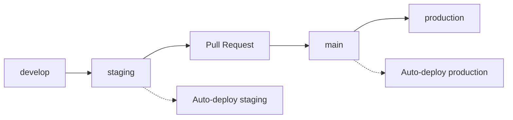

# 🚀 GeneaIA - CI/CD Production Ready

## 📋 Configuration automatique

Cette configuration CI/CD est optimisée pour la production avec :

- ✅ **Sécurité** : Mots de passe générés, secrets GitHub, headers sécurisés
- ✅ **Performance** : Cache Docker, compression gzip, optimisations Nginx  
- ✅ **Fiabilité** : Health checks, rollback automatique, backups
- ✅ **Monitoring** : Tests de santé complets, logs détaillés
- ✅ **Scalabilité** : Rate limiting, compression, cache des assets

## 🏗️ Architecture

```
┌─────────────────────────────────────────────────────────────┐
│                    Serveur 168.231.86.179                  │
├─────────────────────────────────────────────────────────────┤
│                                                             │
│  ┌─────────────────┐    ┌──────────────────────────────────┐ │
│  │   STAGING       │    │         PRODUCTION               │ │
│  │                 │    │                                  │ │
│  │ Frontend :3010  │    │     Nginx :8080                  │ │
│  │ Backend  :3011  │    │       ↓                          │ │
│  │ Postgres        │    │ Frontend + Backend + Postgres    │ │
│  └─────────────────┘    └──────────────────────────────────┘ │
│                                                             │
└─────────────────────────────────────────────────────────────┘
```

## 🔧 Installation rapide

### 1. Configuration automatique
```bash
# Exécuter le script de configuration
chmod +x setup-cicd.sh
./setup-cicd.sh
```

### 2. Générer les clés SSH
```bash
# Générer une clé SSH dédiée
./generate-ssh-key.sh

# Copier la clé sur le serveur
ssh-copy-id -i ~/.ssh/geneaia-deploy.pub root@168.231.86.179
```

### 3. Configurer GitHub Secrets
Copier tous les secrets depuis `secrets-github.txt` dans :
**GitHub** → **Settings** → **Secrets and variables** → **Actions**

### 4. Tester le déploiement
```bash
git add .
git commit -m "🚀 Setup: production-ready CI/CD"
git push origin staging
```

## 📊 Environnements

| Environnement | Déclencheur | URL | Description |
|---------------|-------------|-----|-------------|
| **Staging** | Push sur `staging` | http://168.231.86.179:3010 | Tests et preview |
| **Production** | Push sur `main` | http://168.231.86.179:8080 | Application live |

## 🔐 Sécurité

### Mots de passe générés automatiquement
- Complexité : 25 caractères alphanumériques
- Unique pour chaque environnement
- Stockés dans GitHub Secrets

### Headers de sécurité (Production)
```nginx
X-Frame-Options: SAMEORIGIN
X-Content-Type-Options: nosniff  
X-XSS-Protection: 1; mode=block
```

### Rate limiting
- API : 10 requêtes/seconde par IP
- Burst : 20 requêtes maximum

## ⚡ Performance

### Cache et compression
- **Gzip** : Compression automatique des assets
- **Cache** : Assets statiques cachés 1 an
- **Docker** : Cache des layers pour builds rapides

### Optimisations Nginx
- Compression gzip activée
- Cache des assets statiques
- Headers de performance optimisés

## 🛡️ Fiabilité

### Health checks automatiques
- **PostgreSQL** : Vérification de connexion
- **Backend** : Test des endpoints API
- **Frontend** : Vérification de disponibilité

### Rollback automatique
- Backup automatique avant déploiement production
- Rollback en cas d'échec de démarrage
- Sauvegarde des configurations précédentes

### Backups
- **Base de données** : Backup automatique avant chaque déploiement production
- **Configuration** : Backup des docker-compose.yml
- **Rétention** : Backups horodatés

## 🔍 Monitoring et logs

### Tests de santé
```bash
# Staging
curl http://168.231.86.179:3010      # Frontend
curl http://168.231.86.179:3011/api  # Backend

# Production  
curl http://168.231.86.179:8080      # App complète
curl http://168.231.86.179:8080/api  # API via Nginx
```

### Logs détaillés
- Timestamps sur toutes les opérations
- Tests de santé après chaque déploiement
- Logs d'erreur avec contexte

## 🚀 Workflow de développement

### Branches et déploiements


### Processus recommandé
1. **Développement** sur `develop`
2. **Merge** vers `staging` → Déploiement automatique
3. **Test** sur staging : http://168.231.86.179:3010
4. **Pull Request** de `staging` vers `main`
5. **Merge** → Déploiement automatique en production

## 📝 Secrets GitHub requis

### Staging
```
STAGING_HOST=168.231.86.179
STAGING_USER=root
STAGING_SSH_KEY=<clé_privée_complète>
STAGING_PATH=/var/www/geneaia-staging
STAGING_DB_PASSWORD=<généré_automatiquement>
STAGING_JWT_SECRET=<généré_automatiquement>
```

### Production
```
PROD_HOST=168.231.86.179
PROD_USER=root
PROD_SSH_KEY=<clé_privée_complète>
PROD_PATH=/var/www/geneaia-production
PROD_DB_PASSWORD=<généré_automatiquement>
PROD_JWT_SECRET=<généré_automatiquement>
```

## 🔧 Commandes utiles

### Débogage sur le serveur
```bash
# Se connecter au serveur
ssh -i ~/.ssh/geneaia-deploy root@168.231.86.179

# Logs staging
cd /var/www/geneaia-staging
docker-compose logs -f

# Logs production
cd /var/www/geneaia-production
docker-compose logs -f

# État des services
docker ps
docker-compose ps
```

### Maintenance
```bash
# Restart des services
docker-compose restart backend
docker-compose restart frontend

# Reset complet staging (sans perte production)
docker-compose down
docker volume rm geneaia-staging_postgres_staging_data
docker-compose up -d

# Backup manuel production
docker exec geneaia-db-prod pg_dump -U geneaia_prod -d geneaia_production > backup_manual.sql
```

### Tests manuels
```bash
# Test complet de l'API
curl -X POST http://168.231.86.179:3011/api/auth/login \
  -H "Content-Type: application/json" \
  -d '{"email":"test@test.com","password":"test123"}'

# Test health check
curl http://168.231.86.179:8080/health
```

## 🆘 Dépannage

### Erreur de déploiement
1. **Vérifier les secrets GitHub** sont tous configurés
2. **Tester la connexion SSH** manuellement
3. **Voir les logs** du workflow GitHub Actions
4. **Se connecter au serveur** et vérifier les logs Docker

### Erreur de base de données
```bash
# Reset de la base staging
docker-compose down
docker volume rm geneaia-staging_postgres_staging_data
docker-compose up -d

# Vérifier la connexion
docker exec -it geneaia-db-staging psql -U geneaia_staging -d geneaia_staging
```

### Erreur SSL/certificats (futur)
```bash
# Configuration Let's Encrypt (à ajouter plus tard)
# Cette configuration est prête pour l'ajout de SSL automatique
```

## 📈 Métriques et performance

### Temps de déploiement
- **Staging** : ~3-5 minutes
- **Production** : ~5-8 minutes (avec backup)

### Disponibilité
- **Health checks** : Toutes les 30 secondes
- **Restart automatique** : En cas d'échec
- **Rollback** : Automatique si déploiement échoue

## 🔮 Évolutions futures

### Améliorations prévues
- [ ] **SSL/HTTPS** automatique avec Let's Encrypt
- [ ] **Monitoring** avancé (Prometheus + Grafana)
- [ ] **Logs centralisés** (ELK Stack)
- [ ] **Notifications** Slack/Discord
- [ ] **Tests d'intégration** automatisés
- [ ] **Scaling horizontal** avec Docker Swarm/Kubernetes

### Sécurité avancée
- [ ] **WAF** (Web Application Firewall)
- [ ] **Scan de vulnérabilités** automatique
- [ ] **Rotation automatique** des secrets
- [ ] **Audit logs** complets

## 🎯 Support

### Documentation
- **README principal** : Instructions de base
- **INSTRUCTIONS.md** : Guide détaillé d'installation
- **secrets-github.txt** : Secrets à configurer

### Contacts
- **Issues GitHub** : Pour les bugs et améliorations
- **Pull Requests** : Pour les contributions
- **Documentation** : Mise à jour continue

---

## ✅ Checklist de mise en production

- [ ] Exécuter `./setup-cicd.sh`
- [ ] Générer les clés SSH avec `./generate-ssh-key.sh`
- [ ] Configurer tous les secrets GitHub
- [ ] Tester le déploiement staging
- [ ] Vérifier les URLs staging (3010, 3011)
- [ ] Merger vers main
- [ ] Vérifier le déploiement production (8080)
- [ ] Valider les backups automatiques
- [ ] Documenter les accès pour l'équipe

**🎉 Votre CI/CD est maintenant prêt pour la production !**