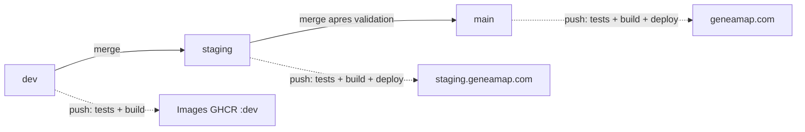

# GeneaIA — CI/CD

Pipeline GitHub Actions : [.github/workflows/deploy.yml](.github/workflows/deploy.yml).
Guide de déploiement complet : [DEPLOY_GUIDE.md](DEPLOY_GUIDE.md).

## Architecture

```mermaid
flowchart LR
  devB[dev] -->|merge| stagingB[staging]
  stagingB -->|merge apres validation| mainB[main]

  devB -.->|push: tests + build| ghcr[Images GHCR :dev]
  stagingB -.->|push: tests + build + deploy| stagingEnv[staging.geneamap.com]
  mainB -.->|push: tests + build + deploy| prodEnv[geneamap.com]
```

| Branche | Déclencheur | Jobs | Cible |
|---|---|---|---|
| `dev` | push | tests + build images `:dev` | — (pas de déploiement) |
| `staging` | push | tests + build `:staging` + deploy | https://staging.geneamap.com |
| `main` | push | tests + build `:latest` + deploy | https://geneamap.com |
| PR → staging/main | pull_request | tests uniquement | — |

## Ce que fait le pipeline

### Job `test` (toutes branches)
- Postgres 15 de service, `npm ci` backend + frontend
- Prisma generate + migrate deploy
- Lint backend/frontend (non bloquant)
- Tests Jest backend, tests layout frontend
- Build frontend Vite

### Job `build` (push sur dev/staging/main)
- Images Docker poussées sur GHCR :
  - `ghcr.io/redakarraid/geneaia-backend:<branche>` (+ `latest` sur main)
  - `ghcr.io/redakarraid/geneaia-frontend:<branche>` (+ `latest` sur main)
- `VITE_API_URL` cuit au build : `https://api.geneamap.com/api` (main), `https://api-staging.geneamap.com/api` (staging)

### Jobs `deploy-*` (push sur staging/main)
1. **scp** du compose du repo (`docker-compose.staging.yml` / `docker-compose.prod.yml`) vers le VPS — **plus de compose inline**, une seule source de vérité.
2. Vérification que `.env` existe sur le serveur (sinon échec explicite).
3. `docker compose pull` + `up -d --remove-orphans`.
4. Migrations Prisma (`migrate deploy`) — échec bloquant.
5. Health check interne (backend) puis externe via Traefik (`https://api*.geneamap.com/api/health`).
6. Backup Postgres automatique avant chaque déploiement production.

## Secrets GitHub requis

| Secret | Valeur |
|---|---|
| `STAGING_HOST` / `PROD_HOST` | `178.238.229.159` (VPS Contabo) |
| `STAGING_USER` / `PROD_USER` | `root` |
| `STAGING_SSH_KEY` / `PROD_SSH_KEY` | clé privée SSH |
| `STAGING_PATH` | `/root/geneaia-staging` |
| `PROD_PATH` | `/root/geneaia` |

Les secrets applicatifs (DB, JWT, **R2**, SMTP, Paystack) sont dans le `.env` **sur le serveur** (voir [.env.production.example](.env.production.example)) — jamais dans GitHub ni dans le repo.

## Stockage

- Local : MinIO (compose local), `STORAGE_AUTO_INIT=true`.
- VPS : **Cloudflare R2** (`geneamap-staging` / `geneamap-prod`), `STORAGE_AUTO_INIT=false`, proxy API activé. Setup : [docs/CLOUDFLARE_R2.md](docs/CLOUDFLARE_R2.md).

## Protection des branches

À configurer sur GitHub (Settings → Branches) :
- `main` : PR obligatoire + status check « Tests et qualité » requis.
- `staging` : status check requis (optionnel).

## Dépannage

1. Workflow rouge au deploy → vérifier les secrets SSH et que `.env` existe dans le dossier cible.
2. Health check externe KO → DNS pas propagé ou Traefik sans certificat ; vérifier `docker logs traefik` sur le VPS.
3. Stockage KO → `bash scripts/check-r2.sh` avec les credentials du `.env`.
4. Rollback base : backups dans `/root/geneaia/backups/backup_<timestamp>.sql`.

## Évolutions futures

- [ ] Job E2E Playwright sur stack Docker éphémère (PR vers main)
- [ ] Notifications de déploiement (Slack/Discord/Telegram)
- [ ] Monitoring (Uptime Kuma déjà présent sur le VPS — ajouter les URLs geneamap.com)
