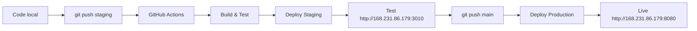

# 🚀 Configuration déploiement automatique GeneaIA

## Situation actuelle
✅ Docker installé sur srv826675 (168.231.86.179)
✅ Docker Compose installé
✅ Pipeline CI/CD configuré dans le projet

## 🎯 Objectif
Déploiement automatique via Pull Request → GitHub Actions → Serveur

---

## 🔑 **ÉTAPE 1 : Configuration SSH sur le serveur**

### Sur le serveur srv826675, exécutez :

```bash
# 1. Créer un utilisateur dédié pour les déploiements (optionnel mais recommandé)
useradd -m -s /bin/bash geneaia-deploy
usermod -aG docker geneaia-deploy

# 2. Ou utiliser root directement (plus simple)
# Nous allons utiliser root pour simplifier

# 3. Générer une clé SSH dédiée pour GitHub Actions
ssh-keygen -t ed25519 -C "github-actions-geneaia" -f /root/.ssh/github-actions -N ""

# 4. Autoriser cette clé pour les connexions
cat /root/.ssh/github-actions.pub >> /root/.ssh/authorized_keys

# 5. Afficher la clé privée (à copier dans GitHub Secrets)
echo "🔐 CLÉ PRIVÉE À COPIER DANS GITHUB SECRETS :"
echo "=============================================="
cat /root/.ssh/github-actions
echo "=============================================="

# 6. Tester la clé localement
ssh -i /root/.ssh/github-actions root@localhost "echo 'SSH OK'"
```

---

## 🔐 **ÉTAPE 2 : Configuration GitHub Secrets**

### Dans votre repository GitHub :

1. **Aller sur** : GitHub.com → Votre repo → **Settings** → **Secrets and variables** → **Actions**

2. **Cliquer** sur **"New repository secret"**

3. **Ajouter ces secrets** (un par un) :

| Nom du secret | Valeur |
|---------------|--------|
| `STAGING_HOST` | `168.231.86.179` |
| `STAGING_USER` | `root` |
| `STAGING_SSH_KEY` | *[Clé privée de /root/.ssh/github-actions]* |
| `STAGING_PATH` | `/var/www/geneaia-staging` |
| `STAGING_DB_PASSWORD` | `7xRr77PJmojqFftNgfmgeovF8` |
| `STAGING_JWT_SECRET` | `2nyEzaFtRa0iXSJYGTIUdMPet` |
| `PROD_HOST` | `168.231.86.179` |
| `PROD_USER` | `root` |
| `PROD_SSH_KEY` | *[Même clé privée]* |
| `PROD_PATH` | `/var/www/geneaia-production` |
| `PROD_DB_PASSWORD` | `PTcyZlFKwZk3tFYM9O02xuzR9` |
| `PROD_JWT_SECRET` | `LcIRXVW9E9vrDLTDHbdE3lhas` |

**Important** : La clé SSH doit être copiée ENTIÈREMENT, y compris les lignes `-----BEGIN` et `-----END`

---

## 🧪 **ÉTAPE 3 : Test du déploiement staging**

### Sur votre machine locale :

```bash
cd /Users/kader/Desktop/projet-en-cours/geneaIA

# 1. Créer ou basculer sur la branche staging
git checkout -b staging || git checkout staging

# 2. Commit des configurations
git add .
git commit -m "🚀 Setup: Auto-deploy configuration"

# 3. Push vers staging (déclenche le déploiement automatique)
git push origin staging
```

### Suivre le déploiement :

1. **Aller sur GitHub** → Votre repo → **Actions**
2. **Voir le workflow** "🚀 GeneaIA CI/CD - Production Ready" en cours
3. **Attendre** que le job "Deploy to Staging" soit ✅

### URLs après déploiement staging :
- **Frontend** : http://168.231.86.179:3010
- **API** : http://168.231.86.179:3011/api/health

---

## 🎯 **ÉTAPE 4 : Déploiement production**

### Une fois le staging validé :

```bash
# 1. Merger staging vers main
git checkout main
git merge staging

# 2. Push vers main (déclenche le déploiement production)
git push origin main
```

### URL production :
- **Application complète** : http://168.231.86.179:8080

---

## 🔄 **Workflow de développement automatisé**



### Commandes pour développement continu :

```bash
# Pour déployer sur staging
git checkout staging
git add .
git commit -m "feat: nouvelle fonctionnalité"
git push origin staging

# Pour déployer en production
git checkout main
git merge staging
git push origin main
```

---

## 📊 **Monitoring et logs**

### Depuis GitHub Actions :
- **Real-time logs** des déploiements
- **Statut** des builds et tests
- **Notifications** en cas d'erreur

### Sur le serveur :

```bash
# Logs staging
cd /var/www/geneaia-staging
docker-compose logs -f

# Logs production
cd /var/www/geneaia-production
docker-compose logs -f

# Status des services
docker ps
```

---

## 🛡️ **Sécurité et backup**

### Backup automatique :
- ✅ **Base de données** : Backup avant chaque déploiement production
- ✅ **Configuration** : Backup des docker-compose.yml
- ✅ **Rollback** : Automatique en cas d'échec

### Monitoring :
- ✅ **Health checks** : Tests automatiques après déploiement
- ✅ **Status monitoring** : Vérification continue des services
- ✅ **Error handling** : Rollback en cas de problème

---

## 🆘 **Dépannage**

### Si le déploiement échoue :

1. **Vérifier GitHub Actions** → onglet Actions
2. **Voir les logs** détaillés du workflow
3. **Vérifier SSH** :
   ```bash
   # Sur le serveur
   ssh -i /root/.ssh/github-actions root@localhost
   ```

### Reset en cas de problème :

```bash
# Sur le serveur, reset staging
cd /var/www/geneaia-staging
docker-compose down
docker volume prune -f
docker-compose up -d
```

---

## ✅ **Checklist finale**

- [ ] ✅ Docker installé sur le serveur
- [ ] ⚠️ Clé SSH générée sur le serveur
- [ ] ⚠️ GitHub Secrets configurés
- [ ] ⚠️ Test push vers staging
- [ ] ⚠️ Validation déploiement staging
- [ ] ⚠️ Test push vers production
- [ ] ⚠️ Validation déploiement production

---

## 🎉 **Résultat final**

Après configuration :
- **Push vers `staging`** → Déploiement automatique sur http://168.231.86.179:3010
- **Push vers `main`** → Déploiement automatique sur http://168.231.86.179:8080
- **Monitoring** via GitHub Actions
- **Rollback** automatique en cas d'erreur
- **Backup** automatique de la base de données

**Temps de déploiement** : ~5-10 minutes par environnement
